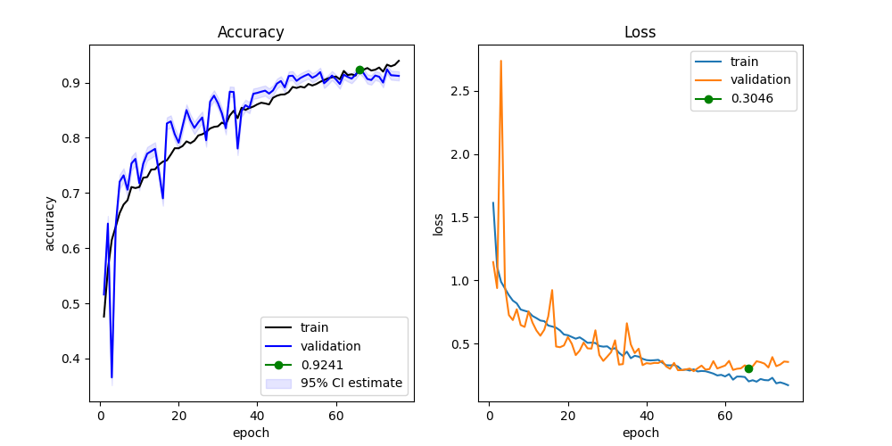
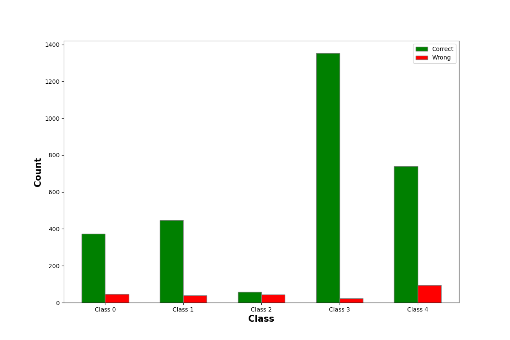

# Pig Posture Classification Source Code
This document outlines the project structure and provides a high-level overview of the implementation for the Pig Posture Classification project. The model correctly classified approximately 85% of the test images on approximately 30% of the test data. The final results will be based on the other 70%, so the final standings may be different.

## 1. Model Architecture & Pipeline
1. Model Architecture & Pipeline
The architecture follows a VGG-inspired "funnel" design, increasing in depth to capture complex spatial features.

### Convolutional Neural Network (CNN)

* Feature Extraction: The model utilizes a sequential structure: 
    `32 → MaxPool → 64 → MaxPool → 128 → MaxPool → 256 → MaxPool → 512 → MaxPool.`

* Feature Hierarchy: Earlier layers learn simple patterns like edges, while deeper layers capture complex shapes.

* Fixed Resolution: nn.AdaptiveAvgPool2d((7, 7)) is used to produce a consistent feature map for the classifier regardless of input variation.

### Classifier Logic

* Linear Projection: A hidden layer with 512 neurons (optimized as a power of 2 for GPU efficiency).

* Regularization: Applied Dropout (p=0.5) to prevent overfitting on the training set.

* Output Layer: A final linear layer with 5 outputs corresponding to the specific posture classes.

## 1. Project Structure Overview

The project is divided into several logical directories to separate raw data, processing scripts, core source code, and training outputs.

`data/`: Contains raw datasets and processed images.

* `train_images/ & test_images/`: Raw input data.

* `train_processed_images/ & test_processed_images/`: Images cropped based on bounding boxes.

* `csv/`: Metadata and annotation files (e.g., train.csv, sample_submission.csv).

`src/`: Core implementation modules.

* `dataset.py`: PyTorch Dataset definitions handling PIL loading and RGB conversion.

* `model.py`: CNN architecture, training epoch logic, and weight initialization.

* `train.py`: Training loops featuring an "Early Restoration" strategy.
 
* `visualize.py`: Tools for plotting accuracy/loss and error distributions.

`outputs/`: Storage for saved model weights (.pth) and visualization plots (.png).

## 2. Folder & File Details

`src/` (Core Logic)

The src directory contains the reusable modules that define the deep learning pipeline.

* `dataset.py`: Implements PigPostureDataset, which inherits from torch.utils.data.Dataset. It handles image loading via PIL and maps image IDs to class labels using a CSV file.

* `model.py`: Defines the PigPosture_CNN architecture.

  * Uses a VGG-inspired "funnel" structure where filters double at each stage (32 -> 64 -> 128 -> 256 -> 512).

  * Includes nn.AdaptiveAvgPool2d((7, 7)) to ensure a fixed input size for the classifier.

  * Contains the training/evaluation logic (train_epoch and assess) within the model class.

`train.py`: Contains the train_model function. It manages the training lifecycle, including tracking validation metrics and restoring the best model weights using a patience-based early stopping mechanism.

`visualize.py`: Provides functions to generate accuracy/loss plots with 95% confidence intervals and bar charts to identify which pig posture classes are most frequently misclassified.

## 3. Data Preparation

These scripts ensure that the model focuses only on the relevant subject by cropping the raw images.

`trainDataProcessing.py / testDataProcessing.py`: Utilize OpenCV and the ast library to parse bounding box strings and crop images to the specific region of interest where the pig is located.

Execution Entry Points

`main.py`: Orchestrates the entire process:

* Sets up ImageNet-standard normalization.

* Splits data into an 80/20 train-validation split.

* Initializes DataLoaders.

* Triggers the training loop and saves the final weights to Google Drive.

* Runs post-training visualizations.

`predict.py`: Loads the trained .pth weights to perform inference on the test set and generates a submission.csv.

| Component        | Detail                                                 |
| ---------------- | ------------------------------------------------------ |
| Framework        | PyTorch                                                |
| Input Resolution | 224 x 224 pixels                                       |
| Augmentation     | Random Affine (Degrees: 20, Translate: 12%, Shear: 15) |
| Optimizer        | Adam                                                   |
| Criterion        | Cross Entropy Loss                                     |
| Hardware         | H100 with Google Clab                                  |

## 4. Summary
* Epoch 76/100 with Patience = 10: Train Loss: 0.1703, Acc: 0.9395, Val Loss:
0.3544, Acc: 0.9122
* Best Validation Performance: Loss 0.2812, Acc 0.9241 (Epoch 66).
* Training Time: 45m 42.57s
* Final Submission Score on Kaggle: 0.851
* 
#### Learning Curves
The plots below illustrate the changes in Loss and Accuracy over the training epochs.

The blue shaded area represents a 95% confidence interval estimate for the true accuracy.

The green dots indicate the performance at the best epoch before early stopping was triggered.

#### Error Analysis (by Class)
The following bar chart displays the distribution of Correct vs. Wrong predictions for each of the 5 pig posture classes within the validation set.

Green Bars: Total number of correctly identified instances per class.

Red Bars: Total number of misclassified instances per class.

